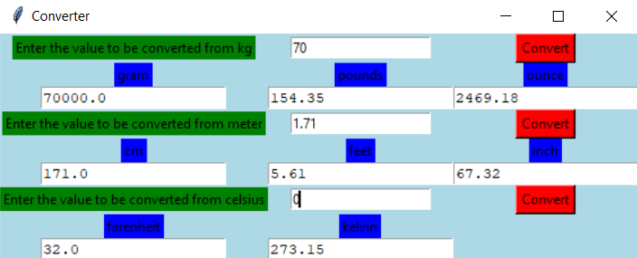

# Converter Calculator

This project can be used as a basic Converter Calculator which converts from one unit of a parameter to three different units and prints the values correct to two decimal places. It performs the following three conversions
1. In mass - kilogram to gram, pounds and ounce
2. In length - metre to centimetre, feet and inch
3. In temperature - celsius to farenheit and kelvin  
  

This project is created using GUI provided in the Tkinter package. The values to be converted is entered in the text boxes. When the Convert button is pressed it converts the entered value into it's respective units. 